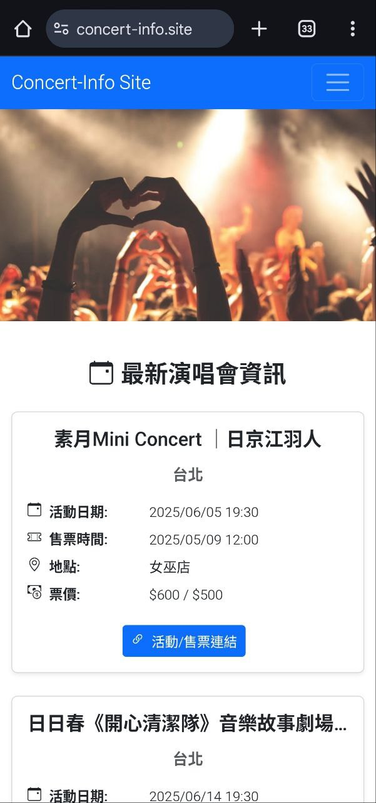
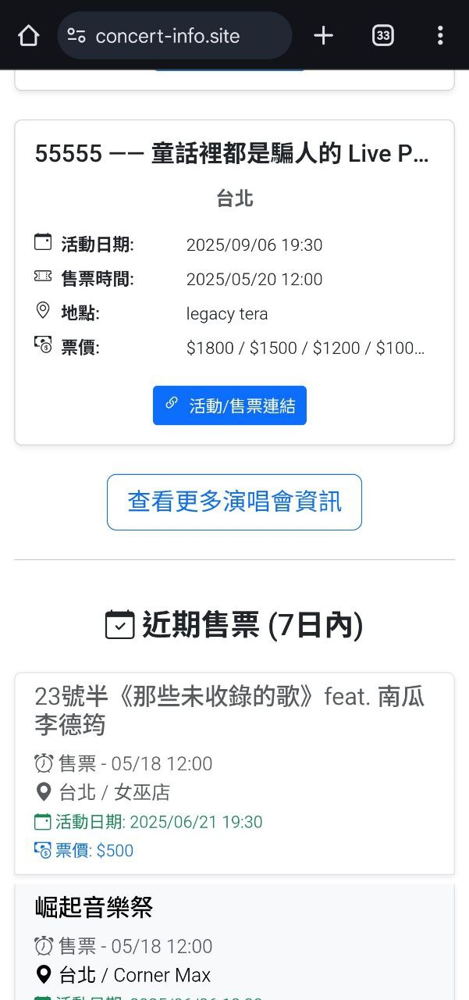
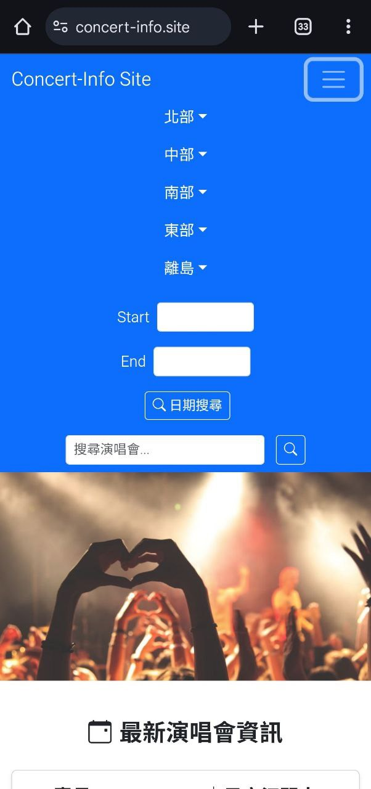

# Concert-Info.site - 音樂會資訊瀏覽、篩選與搜尋平台 (Angular + Express.js)

這是一個全端網頁應用程式，旨在提供一個便捷的音樂會瀏覽、查詢、篩選及**關鍵字搜尋**平台。前端使用 Angular 實現，後端使用
Node.js 和 Express.js 框架，資料庫採用 MongoDB。本專案特別注重響應式網頁設計 (RWD)
，確保使用者在桌面、平板及手機等不同裝置上均能獲得流暢且一致的瀏覽體驗。專案已使用 Docker 進行容器化，並成功部署於 AWS EC2 (
Ubuntu) 伺服器上，透過 Docker Hub 進行映像檔管理。

**線上演示：[concert-info.site](https://concert-info.site)**

**[⬆️ 返回頂部](#concertweb---音樂會資訊瀏覽篩選與搜尋平台-angular--expressjs)**

---

## ✨ 專案亮點與特色

* **全端開發實踐：** 涵蓋前端使用者介面、後端 API 設計及資料庫互動。
* **現代化前端框架：** 使用 Angular 進行模組化、元件化的前端開發。
* **強大的內容查找能力：**
    * 支援按 **關鍵字搜尋** 音樂會。
    * 支援按 **日期** 和 **城市** 篩選音樂會。
* **卓越的跨裝置體驗 (RWD)：** 採用響應式網頁設計，透過 Bootstrap 等技術，確保網站在手機、平板和桌面電腦上均能自適應佈局，提供最佳化的視覺效果與操作便利性。
* **容器化部署 (Docker)：** 使用 Dockerfile 將應用程式（前端和後端）打包成獨立的容器，簡化部署流程並確保環境一致性。
* **雲端部署實戰 (AWS)：** 應用程式運行於 AWS EC2 (Ubuntu) 實例上，並透過 Docker Hub 拉取容器映像檔執行。
* **RESTful API 設計：** 後端提供清晰、標準的 RESTful API 接口供前端調用。
* **多樣化內容瀏覽模式：**
    * **無限滾動/向下查看更多：** 在特定頁面提供持續載入內容的體驗。
    * **分頁瀏覽：** 在其他頁面採用傳統分頁方式組織內容，方便定位。
* **資料庫操作：** 使用 Mongoose ODM 與 MongoDB 資料庫進行互動，實現資料的持久化儲存。
* **環境變數管理：** 後端使用 `.env` 檔案管理敏感配置，提高安全性。

---

## 📸 專案截圖/演示

### 桌面版

* **首頁截圖 :**
  
  
  
* **關鍵字搜尋功能截圖:**
  
* **日期搜尋功能截圖:**
  
* **城市搜尋功能截圖:**
  
* **不同瀏覽模式功能截圖:**
  
  

### 行動版

[//]: # (* **首頁截圖:**)

[//]: # (  ![行動 首頁 封面]&#40;./result-images/mobile_cover.jpg&#41;)

[//]: # (  ![行動 首頁 近期售票]&#40;./result-images/mobile_upcoming_ticketing.jpg&#41;)

[//]: # (* **導覽列**)

[//]: # (  ![行動 首頁 導覽列]&#40;./result-images/mobile_navbar.jpg&#41;)

[//]: # (* **關鍵字搜尋功能截圖:**)

[//]: # (  ![行動 關鍵字搜尋功能]&#40;./result-images/mobile_keyword_search.jpg&#41;)

[//]: # (* **日期搜尋功能截圖:**)

[//]: # (  ![行動 日期搜尋功能]&#40;./result-images/mobile_date_search.jpg&#41;)

[//]: # (* **城市搜尋功能截圖:**)

[//]: # (  ![行動 城市搜尋]&#40;./result-images/mobile_city_selection.jpg&#41;)

[//]: # (* **不同瀏覽模式功能截圖:**)

[//]: # (  ![行動 查看更多]&#40;./result-images/mobile_different_view_more.jpg&#41;)

[//]: # (  ![行動 分頁]&#40;./result-images/mobile_different_view_page.jpg&#41;)

| 行動-首頁-封面 | 行動-首頁-近期售票 | 行動 首頁 導覽列 |
|---|---|---|
|  |  |  |
<!-- 可选：在图片下方添加说明 -->
| 封面說明 | 近期售票說明 | 導覽列說明 |

---

## 🛠️ 主要功能

* **音樂會模組：**
    * 音樂會列表展示 (支援無限滾動和分頁兩種瀏覽模式)
    * **依關鍵字搜尋音樂會** (例如：演唱會名稱、演出者等)
    * **依日期和城市篩選音樂會**
    * 音樂會詳情檢視
* **後端 API 服務：**
    * 提供獲取音樂會列表（支援關鍵字搜尋、篩選參數）和詳情的 API 接口。
* **響應式使用者介面：**
    * 自動適應不同螢幕尺寸，提供手機、平板和桌面電腦的良好瀏覽體驗。

---

## 🚀 技術棧

### 前端 (AngularApp)

* **框架：** Angular (TypeScript)
* **UI 與響應式設計：** HTML, SCSS, **Bootstrap (實現 RWD 的核心)**
* **HTTP 客戶端：** Angular HttpClient
* **路由：** Angular Router
* **狀態管理：** (基礎) RxJS, Services (例如用於管理搜尋/篩選狀態)
* **提示/通知：** ngx-toastr (依賴中可見)
* **其他：**
    * Angular CLI

### 後端 (ExpressServer)

* **框架：** Node.js, Express.js
* **資料庫：** MongoDB (使用 Mongoose ODM，支援文本索引進行關鍵字搜尋)
* **中介軟體：**
    * `cors` (處理跨域請求)
    * `body-parser` (解析請求主體)
    * `morgan` (HTTP 請求日誌)
* **環境變數：** `dotenv`

### 部署與 DevOps

* **容器化：** **Docker**, Dockerfile
* **容器映像檔倉庫：** **Docker Hub**
* **雲端平台：** **AWS EC2 (Ubuntu)**
* **Web 伺服器 (Docker 內)：** Nginx (通常用於提供 Angular 靜態檔案和反向代理 Express API) - *請確認您的 Dockerfile 中是否使用
  Nginx，如果沒有可以移除此項或修改。*

### 開發工具與其他

* **版本控制：** Git & GitHub
* **套件管理器：** npm
* **API 測試：** Postman (推薦)

---

## ⚙️ 環境準備與安裝 (本機運行)

### 必要條件

* Node.js (建議 v14.x 或更高版本)
* npm (通常隨 Node.js 一起安裝)
* Angular CLI (全域安裝：`npm install -g @angular/cli`)
* MongoDB (本機安裝或使用雲端服務如 MongoDB Atlas，**建議為相關欄位建立文本索引以優化關鍵字搜尋**)。
* Docker (用於本機測試容器化部署)

### 安裝步驟 (本機開發)

1. **克隆專案：**
   ```bash
   git clone https://github.com/akuan1997/ConcertWeb-FullStack-Angular-Express.git
   cd ConcertWeb-FullStack-Angular-Express
   ```

2. **設定後端 (ExpressServer)：**
   ```bash
   cd ExpressServer
   npm install
   ```
    * 複製 `.env.example` 為 `.env`：
      ```bash
      cp .env.example .env
      ```
    * 編輯 `.env` 檔案，填寫您的配置，特別是 `MONGO_URI`：
      ```env
      PORT=3000
      MONGO_URI=mongodb://localhost:27017/concertweb # 或您的 MongoDB 連接字串
      # JWT_SECRET 在此版本中未使用，但保留以備未來擴展
      JWT_SECRET=your_very_strong_jwt_secret_key
      ```

3. **設定前端 (AngularApp)：**
   ```bash
   cd ../AngularApp  # 從 ExpressServer 目錄返回上一層再進入 AngularApp
   npm install
   ```
    * 檢查前端 API 請求位址：開啟 `AngularApp/src/environments/environment.ts` (以及 `environment.prod.ts`)，確認 `apiUrl`
      指向您的後端服務 (預設應為 `http://localhost:3000/api` 或相對路徑 `/api` 如果使用 Nginx 反向代理)。

---

## ධ 執行專案 (本機運行)

1. **啟動後端伺服器 (ExpressServer)：**
    * 確保 MongoDB 服務正在執行。
    * 在 `ExpressServer` 目錄下執行：
      ```bash
      npm run dev
      ```
      或
      ```bash
      npm start
      ```
    * 後端伺服器預設會在 `http://localhost:3000` 上執行。

2. **啟動前端應用程式 (AngularApp)：**
    * 在新的終端機視窗中，進入 `AngularApp` 目錄下執行：
      ```bash
      ng serve --open
      ```
      或
      ```bash
      npm start
      ```
    * 前端應用程式預設會在 `http://localhost:4200` 上執行。

---

## 🚢 部署 (Docker & AWS)

本專案使用 Docker 進行容器化，並部署到 AWS EC2 (Ubuntu) 實例。

1. **Dockerfile：**
    * 專案根目錄下應包含 `Dockerfile` (或前端、後端各自的 Dockerfile，然後使用 `docker-compose.yml`)，用於建置應用程式的
      Docker 映像檔。
    * Dockerfile 通常會包含以下步驟：
        * 選擇基礎映像檔 (如 `node` 用於後端，`nginx` 或 `node` 用於前端)。
        * 複製專案檔案到容器中。
        * 安裝依賴。
        * (對於 Angular) 建置生產版本的靜態檔案 (`ng build --prod`)。
        * 設定啟動命令。

2. **建置 Docker 映像檔：**
   ```bash
   # 範例指令 (實際指令取決於您的 Dockerfile 配置)
   docker build -t your-dockerhub-username/concertweb-frontend .  # 假設在 AngularApp 目錄下
   docker build -t your-dockerhub-username/concertweb-backend .   # 假設在 ExpressServer 目錄下
   # 或者，如果您有一個統一的 Dockerfile 或 docker-compose.yml
   # docker-compose build
   ```

3. **推送到 Docker Hub：**
   ```bash
   docker login
   docker push your-dockerhub-username/concertweb-frontend
   docker push your-dockerhub-username/concertweb-backend
   # 或者
   # docker-compose push
   ```
   *(請將 `your-dockerhub-username` 替換為您的 Docker Hub 用戶名)*

4. **在 AWS EC2 (Ubuntu) 上運行：**
    * 登入您的 AWS EC2 Ubuntu 實例。
    * 安裝 Docker (如果尚未安裝)。
    * 拉取 Docker Hub 上的映像檔：
      ```bash
      docker pull your-dockerhub-username/concertweb-frontend
      docker pull your-dockerhub-username/concertweb-backend
      ```
    * 運行容器 (需要處理埠號映射、環境變數傳遞、網路設定等)：
      ```bash
      # 範例指令 (非常簡化，實際需要更完整的指令或 docker-compose.yml)
      docker run -d -p 80:80 your-dockerhub-username/concertweb-frontend
      docker run -d -p 3000:3000 -e MONGO_URI="your_mongo_connection_string" your-dockerhub-username/concertweb-backend
      ```
    * **建議使用 `docker-compose.yml` 在伺服器上管理多個容器的啟動與網路。**
    * 設定 Web 伺服器 (如 Nginx) 進行反向代理，將來自 `concert-info.site` 的請求轉發到相應的 Docker 容器。

**線上版本 [concert-info.site](https://concert-info.site) 即是透過此流程部署。**

---

## 👨‍💻 作者

* **akuan1997**
    * GitHub: [@akuan1997](https://github.com/akuan1997)

---

## 📜 授權 (License)

該專案採用 [MIT](LICENSE) 授權。 (如果您的專案中沒有 LICENSE 檔案，可以考慮添加一個，或者移除此行)

---
**[⬆️ 返回頂部](#concertweb---音樂會資訊瀏覽篩選與搜尋平台-angular--expressjs)**